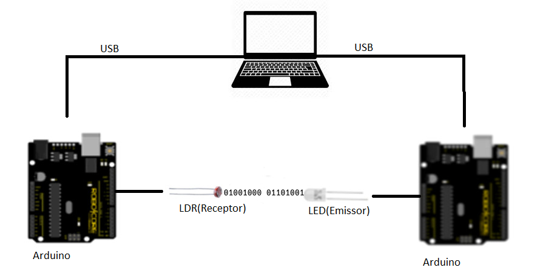

# Li-Fi

Li-Fi ( Light Fidelity ) é um projeto criado em um grupo de iniciação cientifica no Colegio São Francisco de Assis no ano de 2017 com o intuito de estudar sobre essa tecnologia, agora irei continuar com os estudos e quem sabe transformar-lo no meu projeto de TCC para a faculdade.

## O que é o LI-FI

Li-Fi faz parte de uma tecnologia chamada VLC ( Visible Light Communication ) que permite transmitir informações usando lâmpadas LED. É similar ao infravermelho de um controle remoto de uma televisão porém é utilizado o espectro visivel para a transmissão ou seja pode-se utilizar as lampas de LED para iluminação e transmitir dados ao mesmo tempo.

### Como funciona

O sistema é composto por um emissor com um led para o envio de sinal e um receptor com um ldr para a leitura. De acordo com a variação do led emissor o receptor interpreta essa informação e decodifica.

## Objetivo

Estudar a tecnologia, analizar suas caracteristicas, corrigir e melhorar o que foi feito em 2017 [(documento do projeto)](https://github.com/HugoOliveiraSoares/Li-Fi/blob/master/TCC/Li-Fi(2017).pdf)

## Contribuições

Pull requests são bem vindos. Para maiores modificações abra uma issue para discutir o que você gostaria de mudar.