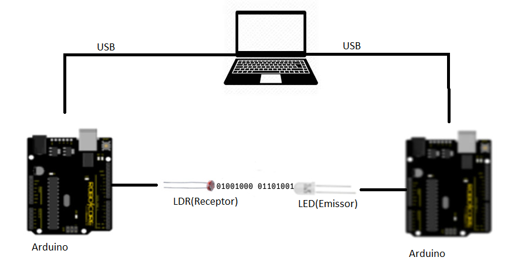

# Li-Fi

[Portuguese version of the readme](README-PT.md)

Li-Fi (Light Fidelity) is a project created in a scientific iniciation group at Colegio São Francisco de Assis in 2017 with the objective of studying about this tecnology, now I going to continue with the studies and maybe turn it into my college graduation project.

## What is LI-FI

Li-Fi is part of a technology called VLC ( Visible Light Communication ) that allows you transmit information using LED lamps. It is similar to the infrared of a television remote control but the visible spectrum is used for the transmission, that is, you can use led lamps for lighting and transmit data at the same time.

### How it works

The system is composed with an emitter with an led for sending signal and an receiver with an ldr for the reading. According to the variation of the led emitter the receiver interprets this information and decodes.

## Objective

Study this tecnology, analyze its characteristics, corret and improve what was done in 2017 [(document of the project)](https://github.com/HugoOliveiraSoares/Li-Fi/blob/master/TCC/Li-Fi(2017).pdf)

## Contributing
Pull requests are welcome. For major changes, please open an issue first to discuss what you would like to change.
